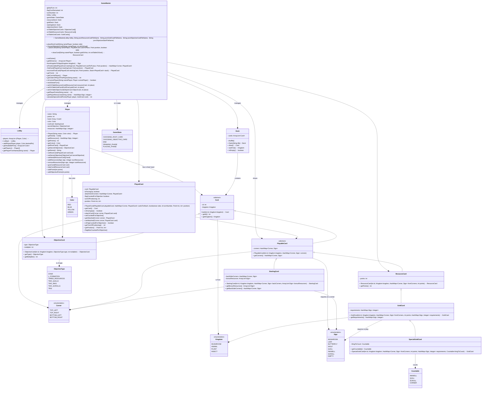

# Model UML

```mermaid
classDiagram
    class GameMaster {
        - globalTurn: int
        - flagTurnRemained: int
        - turnNumber: int
        - lobby: Lobby
        - gameState: GameState
        - resourceDeck: Deck
        - goldDeck: Deck
        - startingDeck: Deck
        - objectivesDeck: Deck
        - onTableObjectiveCards: ObjectiveCard[]
        - onTableResourceCards: ResourceCard[]
        - onTableGoldCards: GoldCards[]

        + GameMaster(Lobby lobby, String jsonResourceCardFileName,  String jsonGoldCardFileName,  String jsonObjectiveCardFileName,  String jsonObjectiveStartFileName)
        + placeRootCard(String namePlayer, boolean side)
        + chooseObjectiveCard(String namePlayer, int whichCard)
        + placeCard(String namePlayer, PlayableCard cardToPlace, Point position, boolean side)
        + drawCard(String namePlayer, boolean goldOrNot, int ontTableOrDeck) : ResourceCard
        + endGame() 
        + getWinners() : ArrayList~Player~
        - fromKingdomToSign(Kingdom kingdom) : Sign
        - isPositionable(PlayedCard startingCard, PlayableCard cardToPLlace, Point position) : HashMap~Corner, PlayedCard~
        ~ findCard(PlayedCard startingCard, Point position) : PlayedCard 
        - recursiveFindCard(PlayedCard startingCard, Point position, Stack~PlayedCard~ stack) : PlayedCard
        + getTurn() : int
        + getCurrentPlayer() : Player
        + getOrderOfPlayOfThePlayer(String name) : int
        + isCurrentPlayer(String namePlayer, Player currentPlayer) : boolean
        + nextGlobalTurn()
        + setOnTableResourceCard(ResourceCard resourceCard, int place)
        + setOnTableGoldCard(GoldCard goldCard, int place)
        + setOnTableObjectCard(ObjectCard ObjectCard, int place)
        + getPlayerPoints(String name) : int
        + getPlayerResources(String name) : HashMap~Sign, Integer~
        - calculateSpecialGoldPoints(Player player, GoldCard card) : int
    }
    GameMaster --* Lobby : manages
    GameMaster --* Player : manages
    GameMaster --* Deck : manages
    GameMaster --* GameState : is in state
    GameMaster --* PlayableCard : shows
    GameMaster --* ResourceCard
    GameMaster --* ObjectiveCard
    GameMaster --* PlayedCard

    class PlayedCard {
        - card: PlayableCard
        - isFacingUp: boolean
        - attachmentCorners: HashMap~Corner, PlayedCard~
        - flagCountedForObjective: boolean
        - turnOfPositioning: int
        - position: Point~int, int~
        + PlayedCard(PlayableCard playableCard, HashMap~Corner, PlayedCard~ cardsToAttach, booleanean side, int turnNumber, Point~int, int~ position)
        + getCard(): Card
        + isFacingUp(): boolean
        + attachCard(Corner corner, PlayedCard card)
        + setCountedForObjective()
        + getAttached(Corner corner) PlayedCard
        + setAttached(Corner corner, PlayedCard card)
        + isFlagCountedForObjective(): boolean
        + getTurnOfPositioning() : int
        + getPosition() : Point~int, int~
        + flagWasCountedForObjective()
    }
    PlayedCard --* PlayableCard
    PlayedCard --* Corner

    class Player {
        - name: String
        - points: int
        - hand: Array ~Card~
        - color: Color
        - rootCard: StartingCard 
        - secretObjective: ObjectiveCard
        - resources: HashMap~Sign, Integer~
        + Player(String name, Color color) : Player
        + getHand() Card[] 
        + getResources() HashMap~Sign, Integer~
        + getPoints() int
        + getColor() Color
        + getRootCard() PlayedCard
        + getSecretObjective() ObjectiveCard
        + getName() String
        + setRootCard(PlayedCard rootCard)
        + setSecretObjective(ObjectiveCard secretObjective)
        + setHand(ResourceCard[] hand)
        + addResources(Sign sign, Integer numResources)
        + removeResources(Sign sign, Integer numResources)
        + giveCard(ResourceCard card)
        + takeCard(ResourceCard card)
        + addPoints(int points)
        + addObjectivePoints(int points)
    }
    Player --* Card : has in their hand 
    Player --* Color : has color
    Player --* ObjectiveCard

    class Lobby {
        - players: ArrayList~(Player, Color)~
        
        + Lobby() : Lobby
        + addPlayer(Player player, Color desiredPin)
        + getAvailablePins() ArrayList~Color~
        + getPlayers() : Player[]
        + getPlayerFromName(String name) : Player

    }

    class Deck {
        - cards: ArrayList~Card~
        - shuffle()
        + Deck(String file):Deck
        + draw(): Card
        + seeFirst(): Kingdom
        + isEmpty(): boolean
    }
    Deck --* Card : contains

    class Card {
        <<abstract>>
        - id: int
        - kingdom: Kingdom
        Card(int id, Kingdom kingdom) : Card
        + getId() int
        + getKingdom() Kingdom
    }
    Card --* Kingdom : is from
    class ObjectiveType {
        STAIR
        L_FORMATION
        THREE_RESOURCES
        TWO_QUILLS
        TWO_INKS
        TWO_SCROLLS
        TRIS
    }
    class ObjectiveCard {
        - type: ObjectiveType
        - multiplier: int
        + ObjectiveCard(int id, Kingdom kingdom, ObjectiveType type, int multiplier) : ObjectiveCard
        + getType() ObjectiveType
        + getMultiplier() int
    }
    ObjectiveCard --* ObjectiveType : is of type 
    class Corner {
        <<enumeration>>
        TOP_LEFT
        TOP_RIGHT
        BOTTOM_LEFT
        BOTTOM_RIGHT
    }
    class PlayableCard {
        <<abstract>>
        - corners: HashMap~Corner, Sign~
        + PlayableCard(int id, Kingdom kingdom,  HashMap~Corner, Sign~ corners)
        + getCorners() HashMap~Corner, Sign~
    }
    PlayableCard --* Corner
    PlayableCard --* Sign : requires at a corner
    class StartingCard {
        - backSideCorners: HashMap~Corner, Sign~
        - bonusResources: ArrayList~Sign~
        + StartingCard(int id, Kingdom kingdom, HashMap~Corner, Sign~ frontCorners, HashMap~Corner, Sign~ backCorners, ArrayList~Sign~ bonusResources) : StartingCard
        + getBonusResources() ArrayList~Sign~
        + getBackSideCorners() HashMap~Corner, Sign~
    }
    StartingCard --* Sign
    StartingCard --* Corner
    class ResourceCard {
        - points: int
        + ResourceCard(int id, Kingdom kingdom, HashMap~Corner, Sign~ frontCorners, int points) : ResourceCard
        + getPoints() int
    }
    class GoldCard {
        - requirements: HashMap~Sign, Integer~
        + GoldCard(int id, Kingdom kingdom, HashMap~Corner, Sign~ frontCorners, int points, HashMap~Sign, Integer~ requirements) : GoldCard
        + getRequirements() HashMap~Sign, Integer~
    }
    GoldCard --* Sign : requires to play
    GoldCard --* Kingdom
    class SpecialGoldCard {
        - thingToCount: Countable
        + getCountable() Countable
        + SpecialGoldCard(int id, Kingdom kingdom, HashMap~Corner, Sign~ frontCorners, int points, HashMap~Sign, Integer~ requirements, Countable thingToCount) : GoldCard
    }
    SpecialGoldCard --* Countable : counts
    Card <|-- ObjectiveCard
    Card <|-- PlayableCard
    PlayableCard <|-- StartingCard
    PlayableCard <|-- ResourceCard
    ResourceCard <|-- GoldCard
    GoldCard <|-- SpecialGoldCard
    
    class GameState {
        CHOOSING_ROOT_CARD
        CHOOSING_OBJECTIVE_CARD
        END
        DRAWING_PHASE
        PLACING_PHASE
    }

    class Countable {
        INKWELL
        QUILL
        SCROLL
        CORNER
    }

    class Kingdom {
        <<enumeration>>
        MUSHROOM
        ANIMAL
        PLANT
        INSECT
    }
    class Sign {
        <<enumeration>>
        MUSHROOM
        LEAF
        BUTTERFLY
        WOLF
        QUILL        
        INKWELL
        SCROLL
        EMPTY
    }
    class Color {
        RED
        BLUE
        YELLOW
        GREEN
    }
```
