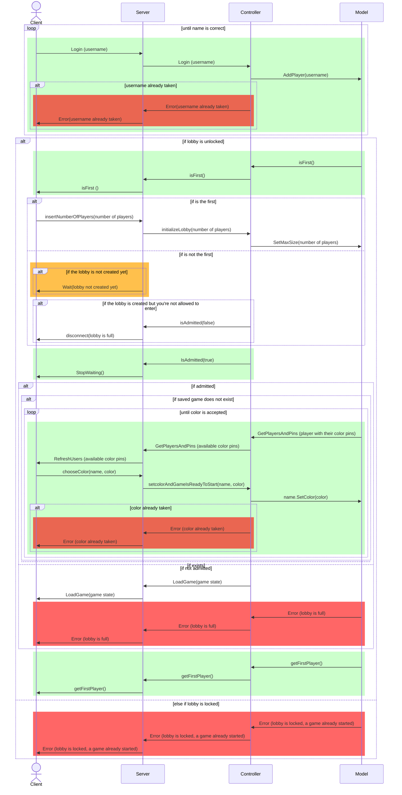
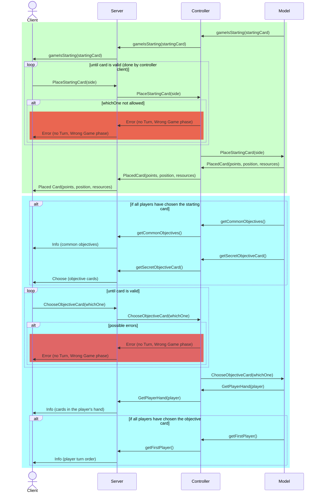
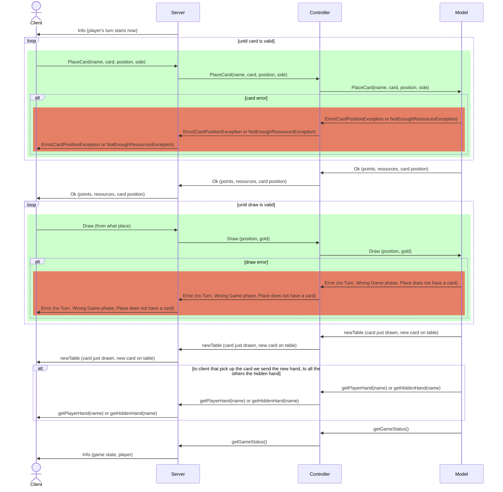
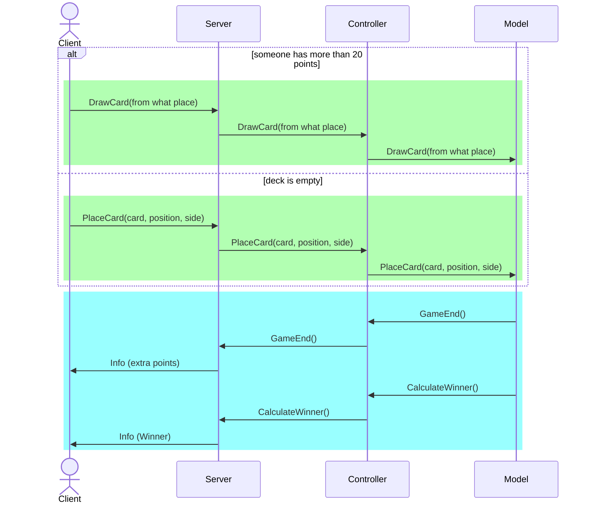
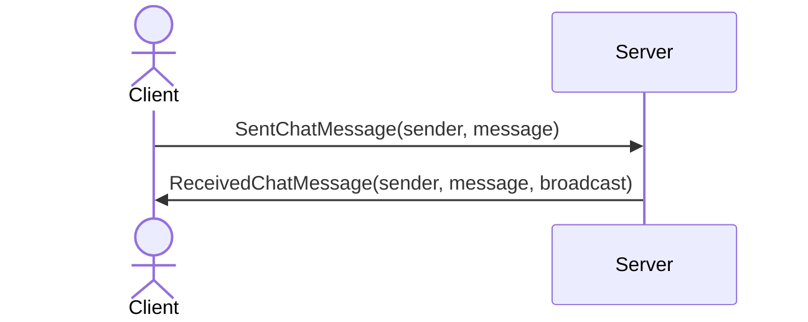

# Connection diagrams

## Introduction

## Server Interface

The NetworkPlug interface defines the methods that are used for network communication in the game.
These methods are called by the NetworkHandler class, which is the class that manages the network connections.
When something happens in the game and this should be notified in a broadcast way, NetworkHandler call the methods for all the different types of connection protocols.
It includes methods for finalizing the number of players, starting the game, refreshing users, sending placed root cards and objective cards, sending hands and secret
objective cards, sending placed cards, sending drawn cards, and sending end game signals.

It is used by the server to communicate with the clients with different types
of network connections.
Each connection protocol will implement this interface, to send messages to the clients broadcast.
Currently, the implemented connections protocols are

1. Socket connection
2. RMI connection

## Network Handler

The ServerSocket class implements the SocketServerInterface and NetworkPlug interfaces.
This class is the controller of the network part of the server.
It manages the connections with the clients and the broadcast of the messages.
In particular protocol connection, when a message should be broadcast, the message is sent to all different connection protocols.
Each protocol will send the message to all the clients connected to it and each
protocol has a different way to send the message to the clients, but all its methods are override NetworkPlug.

## Server RMI

The ServerRMI class implements the RMIServerInterface and NetworkPlug interfaces.
It is responsible for handling the server-side logic of the RMI network communication.
It maintains a map of connections to RMIClientInterface objects, representing the connected clients.

The class provides methods for various game actions such as login, choosing color, placing cards, drawing cards, etc.
These methods are invoked by the client and the corresponding actions are performed on the server side.

The class also provides methods for broadcasting game state updates to all connected clients.
These methods are invoked by the server when the game state changes, and the updates are sent to the clients.

## Server Socket

This class implements the NetworkPlug interface and is responsible for

managing the server-side socket communication.
It maintains a ServerSocket object for accepting incoming connections, a
Controller object for accessing the game state and performing game actions,
and a HashMap for storing the connections to the clients.

The key in the HashMap is the address of the client socket, and the value is
the ClientHandler object representing the connection.
The class also includes methods for starting the server, broadcasting
messages to all clients, handling the game start process, refreshing the user
list,
sending chat messages, broadcasting the information of a placed root card,
sending the hands of the players, broadcasting the information of a drawn
card,
broadcasting the end game signal, and disconnecting all clients.

## Login

Login phase illustrates the interaction between the client and server before the creation of the game.
The client sends a ping to the server to establish a connection. The server checks:

1. Lobby is locked, so the game already started
2. The player is first, so he/she can create the game.

While the first player decide the number of players, other clients are put in waiting state.
When the lobby is created, the server must notify the clients to choose username and color. And when the last player
confirms username and color the game starts.

During this phase, if there is a saved game in the server played
by the same users as the ones currently admitted, the game is loaded with `LoadGame` and the game jumps to the _GameFlow_ section.

There are two blocked situations:

1. We proceed with the color phase only if the first player has chosen the number of players and the lobby is created and full (with the number selected by the first player).
2. If so, we wait that all the players have chosen their color and then we start the game.

## Game Start

When the last player joins the lobby, the server must notify the clients that the game is about to start.
The server must notify the clients of the starting card and the common objectives, also it must
notify the clients of the cards in the player's hand and the player turn order.

The green box represents the choose of starting card while the blue one is about choosing objective card.

## Game Flow

The game flow is the main part of the game.
The player can place and draw cards. The server must notify the clients of the player's turn and the table cards status.

The server-side message are called in a broadcast way. We send to all clients the same message, so they can update their game status.
Also we send broadcast the new Table and the new PlacedCard, so the clients can update the table and the player's hand.
We update the hand of who perform drawCard correctly, while we update the hidden hand of the others.

## End Game

During the end game, the turns are the same as in the game flow, just the server must notify the players of the fact that the game is about to end.
This can happen when the deck is empty or someone has reached more than 20 points. Our implementations checks it after each turn:

1. After each turn when someone draws a card
2. When deck is empty, we check this after the place phase

The two case are represented in the green box. Note: in a game just one of two can happen.

The blue part is the end game phase.
The server must notify the clients of the extra points(objective card's points) and the winner.

## Chat Messages

Starting with Game Flow on TUI and starting with Game Start in GUI it is possible to send chat messages between players.
Messages are sent only using Server connections and do not use Server Controller and Server Model to save them in game data.

It is also possible to send private messages only to some players adding '@' before their username (also themselves as a clipboard).
The server understanding if it is a private message checking nicknames of other players connected sends it only to the receivers and the sender, otherwise, it sends it to all the clients connected to it.
The data sent to the clients includes also Broadcast data to don't let Client alone to understand if the message is broadcast or not.

